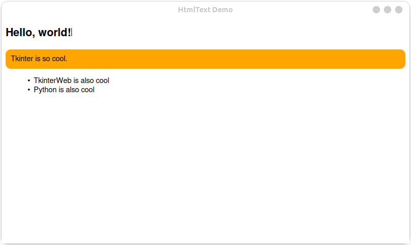

Making Documents Editable
=========================

.. note::
    Caret browsing support is new in version 4.8. The :class:`~tkinterweb.HtmlText` widget was made editable in version 4.15. Make sure you are using the latest version of TkinterWeb.

Overview
--------

**TkinterWeb can be used to create a rich text or HTML editor.**

The :class:`~tkinterweb.HtmlText` widget provides a simple HTML editor that can be extended to adapt to the needs of your application.

TkinterWeb also provides a useful API for developers to create their own HTML-based what-you-see-is-what-you-get editor.

These features are new. Please reach out to report a bug, suggest an improvement, or seek support.

Setup
------

To enable caret browsing mode, add ``yourhtmlframe.configure(caret_browsing_enabled=True)`` to your script or add the parameter ``caret_browsing_enabled=True`` when creating your :class:`~tkinterweb.HtmlFrame` or :class:`~tkinterweb.HtmlLabel` widget.

When enabled, a caret will appear once the user clicks on text in the document. Use the methods described below to handle keypresses, or instead use the :class:`~tkinterweb.HtmlText` widget which handles most cases on its own.

How-to
------

Simply create your :class:`~tkinterweb.HtmlText` and start editing!

.. code-block:: python

    from tkinterweb import HtmlText
    yourhtmlframe = HtmlText(root)

You can also load html, files, and websites. For instance, to create an editable page with a heading, an orange block, and a list, you could use the following:

.. code-block:: python

    yourhtmlframe = HtmlText(root)
    yourhtmlframe.load_html("""<h2>Hello, world!</h2>
    

        
Tkinter is so cool.

    

    <ul>
        <li>TkinterWeb is also cool</li>
        <li>Python is also cool</li>
    </ul>""")

It's that easy! 

You can insert and edit hyperlinks, images, and much more. Click on a hyperlink while pressing the Ctrl key to navigate to it. Like the :class:`~tkinterweb.HtmlFrame` widget, the :class:`~tkinterweb.HtmlText` widget is also scrollable out of the box!

Customization
-------------

Everything described below applies to all HTML widgets with caret browsing enabled.

Use :meth:`.HtmlFrame.get_caret_position` to get the caret's position. The element returned will always be a text node.

.. tip::
     You can use the methods outlined in the `HTMLElement documentation <api/htmldocument.html#tkinterweb.dom.HTMLElement>`_ to get the element's parent if needed. From here you can insert new elements, change the text and much more!

Use :meth:`.HtmlFrame.shift_caret_left` or :meth:`.HtmlFrame.shift_caret_right` to shift the caret left or right.

The following is a simple example showing how to handle keypresses to insert letters and numbers:

.. code-block:: python
    
    def on_keypress(event):
        # Get the caret's position
        caret_position = yourhtmlframe.get_caret_position()
        if caret_position and event.char:
            element, text, index = caret_position
            
            # Add the key's character to the element's text
            newtext = text[:index] + event.char + text[index:]

            # Set the element's text
            element.textContent = newtext

            # Shift the caret right
            yourhtmlframe.shift_caret_right()

    yourhtmlframe.bind("<Key>", on_keypress)

This works on all HTML widgets.

.. warning::
    If using the :class:`~tkinterweb.HtmlText` widget, binding to ``<Key>`` will remove all default key bindings. Either bind to individual keys as needed or use ``yourhtmlframe.bind("<Key>", on_keypress, add="+")``, but keep in mind then both bindings will fire.

.. note::
    Most HTML elements collapse spaces. To insert a space into the document's text, it is usually best to use a non-breaking space (``"\xa0"`` or ``"&nbsp;"``).

Use :meth:`.HtmlFrame.set_caret_position` to set the caret's position if you know the element and index you want to place the caret at.

Some extra logic will be needed to handle other types of keypresses. See the :class:`~tkinterweb.HtmlText` source code for inspiration.

.. tip::
    When handling backspaces at the start of a node or deletions at the end of a node, it is sometimes useful to find the previous or following text nodes, respectively. 
    
    You can get the preceeding or following text nodes by using :meth:`.HtmlFrame.shift_caret_left` or :meth:`.HtmlFrame.shift_caret_right` followed by :meth:`.HtmlFrame.get_caret_position`.

Use :meth:`.HtmlFrame.get_selection_position` to get the position of any selected text and :meth:`.HtmlFrame.clear_selection` to clear the selection. 

You may need to set the caret's position after modifying the document.

.. tip::
    :meth:`.HtmlFrame.set_caret_position` will raise an error if the element provided has been removed or is empty. 
    
    If you need to remove or empty the elements returned by :meth:`.HtmlFrame.get_selection_position` or :meth:`.HtmlFrame.get_caret_position`, you can also get the selection or caret's position relative to the page text content using :meth:`.HtmlFrame.get_selection_page_position` and :meth:`.HtmlFrame.get_caret_page_position`, respectively.

    You can then use :meth:`.HtmlFrame.set_selection_page_position` or :meth:`.HtmlFrame.set_caret_page_position` to set the selection or caret relative to the page text content. 

The following code can be used as a starting point on handling backspaces when text is selected:

.. code-block:: python

    def on_backspace(event):
        # Get the selection's position and deselect all selected text
        selection = yourhtmlframe.get_selection_position()

        if selection:
            start, end, middle = selection
            start_element, start_element_text, start_element_index = start
            end_element, end_element_text, end_element_index = end

            # Deselect all selected text
            d.clear_selection()

            # Cut out the selection
            start_element.textContent = start_element_text[:start_element_index] + start_element_text[end_element_index:]

            if start_element != end_element:
                # Delete the end element
                end_element.remove()

                # Remove each element that is fully selected, and its parent if it is now empty
                for element in middle:
                    parent = element.parentElement
                    element.remove()
                    if len(parent.children) == 0:
                        parent.remove()

            # Set the caret's position
            yourhtmlframe.set_caret_position(start_element, start_element_index)

    yourhtmlframe.bind("<BackSpace>", on_backspace)

You can use :meth:`.HtmlFrame.set_selection_position` to set the selection if needed.

-------------------

See the `HtmlFrame documentation <api/htmlframe.html#tkinterweb.HtmlFrame.get_caret_position>`_ for a complete list of supported methods.

Please report bugs or request new features on the `issues page <https://github.com/Andereoo/TkinterWeb/issues>`_.