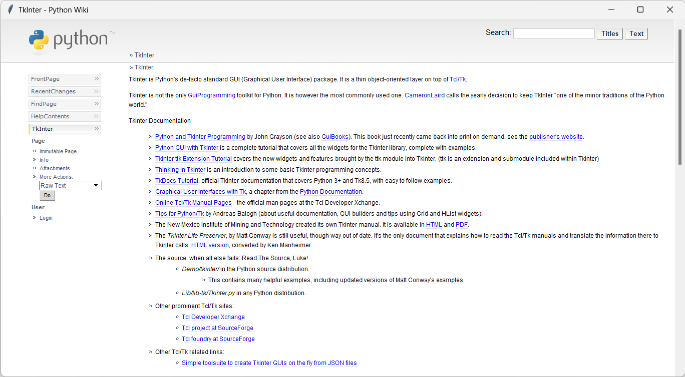

Getting Started
===============

.. warning::
    The API changed significantly in version 4.0.0. See :doc:`upgrading` for details.

Installation
------------

To use TkinterWeb, first install it using pip:

.. code-block:: console

   $ pip install tkinterweb

Or, you can choose to install optional dependencies as well:

.. code-block:: console

   $ pip install tkinterweb[javascript] # to also install JavaScript support
   $ pip install tkinterweb[svg] # to also install Scalable Vector Graphics support.
   $ pip install tkinterweb[full] # to install all optional dependencies

You can run the TkinterWeb demo to see if it worked!

>>> from tkinterweb import Demo
>>> Demo()

TkinterWeb requires :py:mod:`Tkinter`, :py:mod:`TkinterWeb-Tkhtml`, :py:mod:`PIL`, and :py:class:`PIL.ImageTk`. All dependencies should be installed when installing TkinterWeb, but on some systems :py:class:`PIL.ImageTk` may need to be installed seperately in order to load most image types.

Getting Started
----------------

**TkinterWeb is very easy to use! Here is an example:**

.. code-block:: python

    import tkinter as tk
    from tkinterweb import HtmlFrame # import the HtmlFrame widget
    
    root = tk.Tk() # create the Tkinter window
    
    ### The important part: create the html widget and attach it to the window
    yourhtmlframe = HtmlFrame(root) # create the HtmlFrame widget
    yourhtmlframe.load_html("<h1>Hello, World!</h1>") # load some HTML code
    yourhtmlframe.pack(fill="both", expand=True) # attach the HtmlFrame widget to the window
    
    root.mainloop()

.. note::
    To load a website, call ``yourhtmlframe.load_website("www.yourwebsite.com")``.
    
    To load a file, call ``yourhtmlframe.load_file("/path/to/your/file.html")``.
    
    To load any generic url, call ``yourhtmlframe.load_url(yourwebsiteorfile)``. Keep in mind that the url must be properly formatted and include the url scheme.

The :class:`~tkinterweb.HtmlFrame` widget behaves like any other Tkinter widget and supports bindings. It also supports link clicks, form submittions, website title changes, and much, much more! Refer below for more tips and tricks!

Tips and Tricks
---------------

**Bindings**

Like any other Tkinter widget, mouse and keyboard events can be bound to the :class:`~tkinterweb.HtmlFrame` widget.

The following is an example of the usage of bingings to show a menu:

.. code-block:: python

    def on_right_click(event):
        element = yourhtmlframe.get_currently_hovered_element() # get the element under the mouse
        url = element.getAttribute("href") # get the element's 'href' attribute
        if url: #if mouse was clicked on a link
            url = yourhtmlframe.resolve_url(url) # resolve the url so that partial urls are converted to full urls
            menu = tk.Menu(root, tearoff=0) # create the menu
            menu.add_command(label="Open %s" % url, command=lambda url=url: yourhtmlframe.load_url(url)) # add a button to the menu showing the url
            menu.tk_popup(event.x_root, event.y_root, 0) # show the menu
    yourhtmlframe.bind("<Button-3>", on_right_click)

This will make a popup open when the user right-clicks on a link. Clicking the link shown in the popup would load the website.

Similarly, bindings can also be applied to navigation keys:  

.. code-block:: python

    yourhtmlframe.bind_all("<Up>", lambda e: yourhtmlframe.yview_scroll(-5, "units"))
    yourhtmlframe.bind_all("<Down>", lambda e: yourhtmlframe.yview_scroll(5, "units"))
    yourhtmlframe.bind_all("<Prior>", lambda e: yourhtmlframe.yview_scroll(-1, "pages"))
    yourhtmlframe.bind_all("<Next>", lambda e: yourhtmlframe.yview_scroll(1, "pages"))
    yourhtmlframe.bind_all("<Home>", lambda e: yourhtmlframe.yview_moveto(0))
    yourhtmlframe.bind_all("<End>", lambda e: yourhtmlframe.yview_moveto(1))

Alternatively, you can also use the :attr:`on_element_script` parameter of the :class:`~tkinterweb.HtmlFrame` widget to set a callback for events emitted by individual HTML elements (i.e. handle an element's ``onclick`` attribute). See :ref:`using-your-own-interpreter` for more details and the `HtmlElement documentation <api/htmldocument.html#tkinterweb.dom.HTMLElement.onchange>`_ for a full list of supported events.

**Changing the title**

To change the title of the window every time the title of a website changes, use the following:

.. code-block:: python

    def change_title(event):
        root.title(yourhtmlframe.title) # change the title
        
    yourhtmlframe.bind("<<TitleChanged>>", change_title)

Similarily, the ``<<IconChanged>>`` event fires when the website's icon changes.

**Url changes**

Normally, a website's url may change when it is loaded. For example, "https://github.com" will redirect to "https://www.github.com". This can be handled with a binding to ``<<UrlChanged>>``:

.. code-block:: python

    def url_changed(event):
        updated_url = yourhtmlframe.current_url
        ## Do stuff, such as change the content of an address bar
        
    yourhtmlframe.bind("<<UrlChanged>>", url_changed)

This is highly recomended if your app includes an address bar. This event will fire on page redirects and url changes when a page stops loading.

**Search the page**

Use :meth:`~tkinterweb.HtmlFrame.find_text` to search the page for specific text. To search the document for the word 'python', for example, the following can be used:

.. code-block:: python

    number_of_matches = yourhtmlframe.find_text("python")

Or, to select the second match found:

.. code-block:: python

    number_of_matches = yourhtmlframe.find_text("python", 2)

Refer to the API reference for more information and `bug 18 <https://github.com/Andereoo/TkinterWeb/issues/18#issuecomment-881649007>`_ or the `sample web browser <https://github.com/Andereoo/TkinterWeb/blob/main/examples/TkinterWebBrowser.py>`_ for a sample find bar.

**Done loading?**

The ``<<DoneLoading>>`` event fires when the document is done loading. 

When binding to ``<<DoneLoading>>`` to, for example, change a 'stop' button to a 'refresh' button, it is generally a good idea to bind to ``<<DownloadingResource>>`` to do the opposite. Otherwise, the document may show that is is done loading while it is still loading.

**Stop loading**

The method :meth:`~tkinterweb.HtmlFrame.stop` can be used to stop loading a webpage. If :meth:`~tkinterweb.HtmlFrame.load_url`, :meth:`~tkinterweb.HtmlFrame.load_website`, or :meth:`~tkinterweb.HtmlFrame.load_file` was used to load the document, passing ``yourhtmlframe.current_url`` with ``force=True``  will force a page refresh.

**Link clicks**

Link clicks can also be easily handled. By default, when a link is clicked, it will be automatically loaded.
To, for example, run some code before loading the new website, use the following: 

.. code-block:: python

    yourhtmlframe = HtmlFrame(master, on_link_click=load_new_page)
    
    def load_new_page(url):
        ## Do stuff
        yourhtmlframe.load_url(url) # load the new website    

Similarily, :attr:`on_form_submit` can be used to override the default form submission handlers.

**Zooming**

Setting the zoom of the :class:`~tkinterweb.HtmlFrame` widget is very easy. This can be used to improve accessibility in your application. To set the zoom to 2x magnification the following can be used: 

.. code-block:: python

    yourhtmlframe = HtmlFrame(master, zoom=2)
    # or yourhtmlframe.configure(zoom=2)
    # or yourhtmlframe["zoom"] = 2

To scale only the text, use ``fontscale=2`` instead.

**Manipulating the DOM**

Refer to :doc:`dom` (new since version 3.25).

**Using JavaScript**

Refer to :doc:`javascript` (new since version 4.1).

**Embed a widget**

There are many ways to embed widgets in an :class:`~tkinterweb.HtmlFrame` widget. One way is to use ``<object>`` elements:

.. code-block:: python

    yourcanvas = tkinter.Canvas(yourhtmlframe)
    yourhtmlframe.load_html(f"
This is a canvas!
<object data="{yourcanvas}"></object>")

Refer to :doc:`geometry` for more information.

**Dark mode**

You can set ``dark_theme_enabled=True`` when creating your :class:`~tkinterweb.HtmlFrame` or calling :meth:`~tkinterweb.HtmlFrame.configure` to turn on dark mode and automatically modify page colours.

If you set ``image_inversion_enabled=True``, an algorithm will attempt to detect and invert images with a predominantly light-coloured background. This helps make light-coloured images or pictures with a white background darker.

Refresh the page for these features to take full effect. This features are a work-in-progress and may cause hangs or crashes on more complex websites.

See the :doc:`api/htmlframe` for a complete list of available commands.
